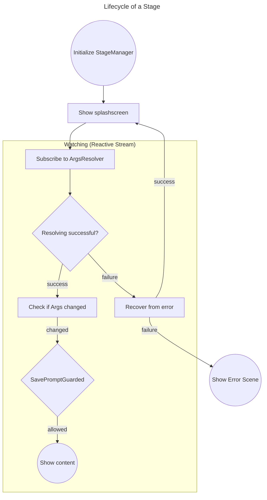

```mermaid
---
title: Lifecycle of a Stage
---
flowchart TD
    initializing((Initialize StageManager)) --> loading[Show splashscreen]
    loading --> resolving[Subscribe to ArgsResolver]
    
    subgraph Watching ["Watching (Reactive Stream)"]
        resolving --> resolved{Resolving successful?}
        resolved -- success --> detectingchanges[Check if Args changed]
        resolved -- failure --> recovering[Recover from error]
    
        detectingchanges -- changed --> savepromptevaluation{SavePromptGuarded}
    
        savepromptevaluation -- allowed --> showcontent((Show content))
    end
    
    recovering -- success --> loading
    recovering -- failure --> stopped((Show Error Scene))
```