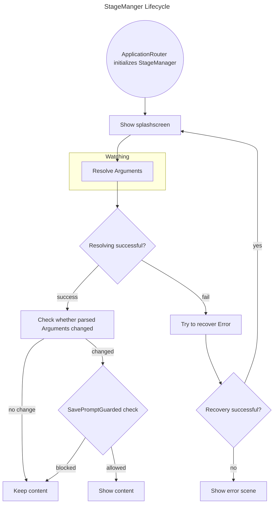

Plan carefully, this is a very large and very important architectural work!
You are an experienced software architect. Produce clean, flexible and maintainable code.

Implement the StageManager Lifecycle as described below:

You are allowed to edit
- StageManager
- MainStageManager
- ApplicationRouter
- MainScene
- MainStageContext
- and other stuff if absolutely necessary (for example return types of ArgsParser and below)

More hints:
* You may or may not keep StageManager as a separate abstract class (read EditCardStageManager and EditBoardStageManager to check whether that makes sense or not)
* You may or may not reuse existing code. The "watching" hint from the Mermaid Flowchart diagram below means that this is a Flow.Publisher that should be observed
* "Check whether parsed arguments changed": Add // TODO comment to implement SavePromptGuarded (canDeactivate(): CompletableFuture<Void>, save(): CompletableFuture<Boolean>, dismiss(): CompletableFuture<Void>)

