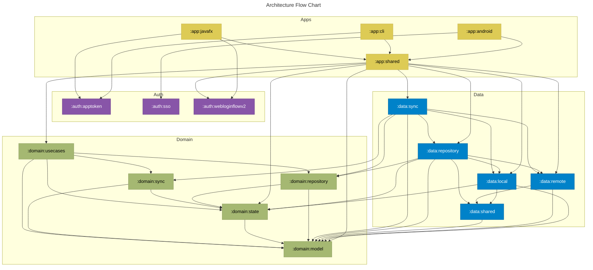
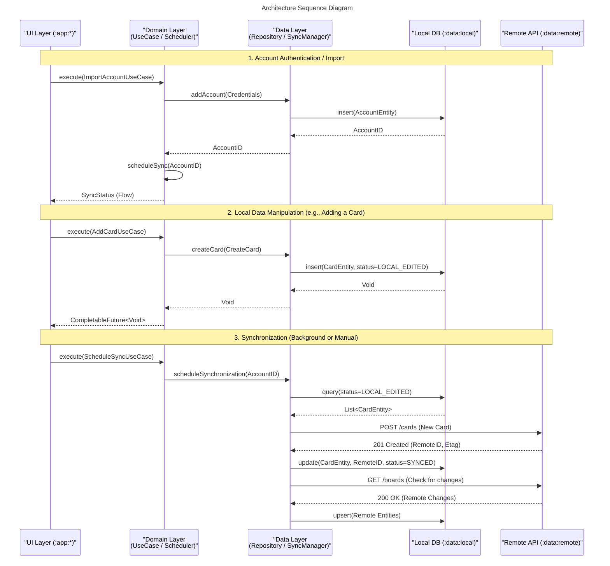

# Architecture

This document describes the architecture of the Nextcloud Deck project. It follows a modular structure inspired by Clean Architecture, separating business logic from implementation details.

## Module Dependency Graph

The following flowchart visualizes the dependencies between the Gradle modules.

## Core Workflows

### Data Lifecycle & Synchronization

The following sequence diagram illustrates the unified flow of account import, local data manipulation, and the subsequent synchronization process.

## Architectural Layers

### 1. Domain Layer (`:domain:*`)
The core of the application, containing business logic and rules. It is written in pure Java to ensure portability and ease of testing.
*   **model**: Plain Java objects (Entities) representing Deck concepts (Boards, Cards, Labels).
*   **usecases**: Interactors that implement specific business workflows.
*   **repository/sync/state**: Interfaces and abstractions for data access and state management.

### 2. Data Layer (`:data:*`)
Implements the interfaces defined in the Domain layer.
*   **local**: Persistent storage using Room (SQLite).
*   **remote**: Network communication using Retrofit and OpenAPI generated clients.
*   **repository/sync**: Orchestration between local and remote data sources, implementing the offline-first strategy.

### 3. Auth Layer (`:auth:*`)
Handles authentication mechanisms across different platforms.
*   **sso**: Android-specific Single Sign-On integration.
*   **webloginflowv2**: Nextcloud Web Login Flow implementation.

### 4. Apps Layer (`:app:*`)
Platform-specific entry points and UI implementations.
*   **android**: Jetpack Compose based Android application.
*   **javafx**: JavaFX based desktop application.
*   **cli**: Command-line interface using Picocli.
*   **shared**: A cross-cutting module that aggregates common dependencies and provides shared utilities to all client apps.

## Architectural Patterns

### Clean Architecture
The project strictly separates the **Domain** (business logic) from **Data** (infrastructure) and **Apps** (UI). The Domain layer is pure Java and has no knowledge of how data is stored or how the UI is rendered.

### CQRS (Command Query Responsibility Segregation)
The project follows the CQRS pattern with a specific rule:
*   **Queries**: UseCases that read data for the UI. They return reactive types like `Flow.Publisher`.
*   **Commands**: UseCases that write data. They return `CompletableFuture` to signal completion.
*   *Note*: UseCases should either read or write, but not both.

### Threading Model
*   **UI/Main Thread**: Applications expect to receive and apply data on the main thread.
*   **IO Thread**: UseCases are designed to be executed on background threads to keep the UI responsive.

## Coding Principles

### Strongly Typed Domain
To avoid "primitive obsession," business properties like IDs are strictly typed using Java `record`s. For example, a `CardID` is a distinct type rather than a simple `long` or `String`.

### Reactive and Immutable
The architecture favors immutability and reactive streams.
*   Public APIs in the Domain layer use standard Java constructs like `java.util.concurrent.Flow.Publisher` and `java.util.concurrent.CompletableFuture` to hide implementation details (like RxJava).
*   Converters are used internally to bridge reactive libraries with these standard APIs.

## Data Flow
1.  **UI** triggers a **UseCase** (Command or Query).
2.  **UseCase** interacts with a **Repository** (Domain interface).
3.  **Repository Implementation** (in Data layer) fetches/stores data using **Local** (Room) or **Remote** (Retrofit) sources.
4.  **Sync Engine** works in the background to reconcile **Local** and **Remote** states.
